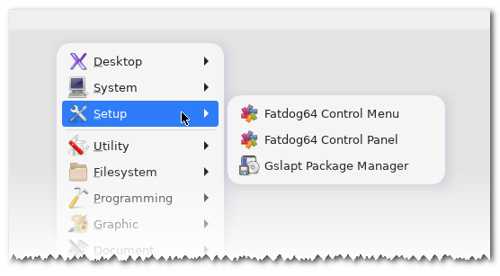

# gtkmenuplus

Scriptable popup menu for Linux

## Features

- Construct a menu from a textual description, from a file or the command line.

- Shell-backed scripting language with variables and conditions.

- Comprehensive [scripting guide] and [usage] documentation.

## Examples

_Many more examples are available in the [online test folder]._

Create a menu entry: ` gtkmenuplus
  'item=edit; cmd=leafpad; icon=leafpad; tooltip=writer' `.

A submenu:  ` gtkmenuplus 'configure=endsubmenu;
  submenu=todo list; item=backup; cmd=backup.sh; endsubmenu' `.

Style an entry: ` gtkmenuplus 'format=fgcolor="brown" font="Monospace 15";
  =~/' ` (open the home folder).

A hierarchical menu from directory contents: ` gtkmenuplus
  'include=~/Pictures/*.jpeg *' `.

A hierarchical menu of application desktop files: ` gtkmenuplus
  'launchersub=~/.local/share/applications' `.

## Dependencies

Linux, GNU glibc, GTK-3.
The code also builds for GTK-2 but I stopped testing GTK-2 builds in late 2023.

## Installing

Please refer to the [installation] guide.

## Project History

**2024–2025**:  
Version 2.0.0 features a completely rewritten codebase, focusing on improved
usability, maintainability, and fixing the numerous original and accumulated
bugs. The scripting language has been enhanced while maintaining backward
compatibility with version 1.1.x. For new features, please refer to the [usage]
and [scripting guide] documents.

**2016–2023**:  
Several minor feature and maintenance releases occurred, culminating
in the release of version 1.1.10 in 2019. A merge patch extending to
commit 97295c2 was incorporated into [Fatdog64]-814 through 903. May
2023 marks the end of life (EOL) for the 1.1.x codebase.

**17-Apr-2016**:  
The 1.0.x codebase was created by forking Alan Campbell's [gtkmenuplus 1.00],
which was originally released on 24-Apr-2013. This codebase
itself was partially based on [MyGtkMenu] by John Vorthman (2004–2011).

[Fatdog64]: <https://distro.ibiblio.org/fatdog/web>
[installation]: <https://github.com/step-/gtkmenuplus/blob/master/INSTALL.md>
[online test folder]: <https://github.com/step-/gtkmenuplus/tree/master/test>
[scripting guide]: <https://github.com/step-/gtkmenuplus/blob/master/docs/scripting_guide.md>
[usage]: <https://github.com/step-/gtkmenuplus/blob/master/docs/usage.md>
[gtkmenuplus 1.00]: <https://sites.google.com/site/entropyreduction/gtkmenuplus>
[MyGtkMenu]: <https://sites.google.com/site/jvinla/home>
